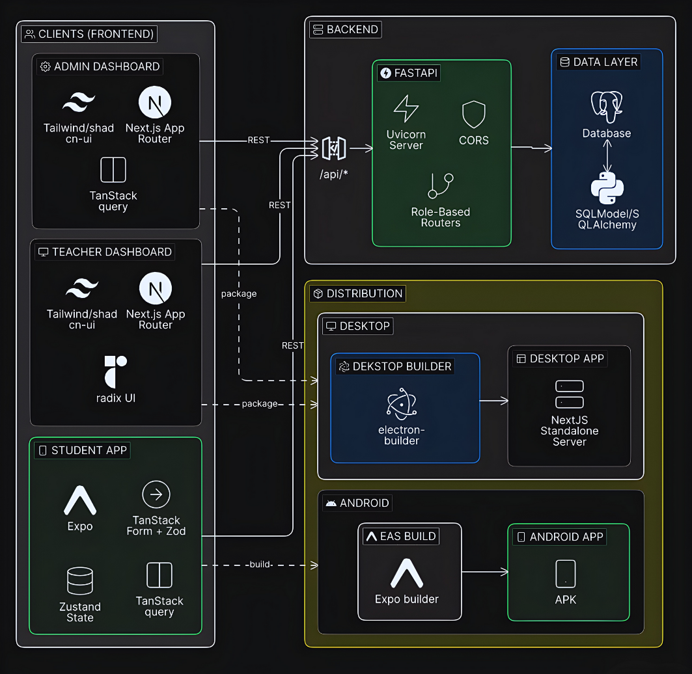

<p align="center">
  
</p>

# Hodory Attendance System

<p align="center">
  
</p>

<p align="center">
  
  
  
  
  
  
  
  
</p>

Hodory is an attendance management system for educational institutions, with:
- a **FastAPI** backend (PostgreSQL + JWT auth)
- a **student mobile app** (Expo / React Native)
- **Admin & Teacher dashboards** (Next.js)
- **desktop apps** (Electron wrappers)

> Status: under development.

## System Architecture

<p align="center">
  
</p>

## Screenshots

### Student (Mobile)
<p align="center">
  
  
  
  
</p>

<p align="center">
  
  
</p>

### Admin


### Teacher


## Repo Structure

- `backend/` — FastAPI API + DB models (SQLModel/SQLAlchemy)
- `frontend_mobile_app/` — Student mobile app (Expo Router)
- `frontend_desktop_apps/`
  - `Hodory-admin/` — Admin dashboard (Next.js)
  - `Hodory-teacher/` — Teacher dashboard (Next.js)
  - `Hodory-admin-electron/` — Admin desktop wrapper (Electron)
  - `Hodory-teacher-electron/` — Teacher desktop wrapper (Electron)

## Backend (FastAPI)

### Prerequisites
- Python 3.10+
- PostgreSQL

### Setup
```bash
cd backend
python -m venv .venv
source .venv/bin/activate
pip install -r requirements.txt

cp .env.local.example .env.local
```

### Run
```bash
cd backend
python runserver.py
```

API docs:
- Swagger: `http://127.0.0.1:8000/docs`
- ReDoc: `http://127.0.0.1:8000/redoc`

## Mobile App (Expo)

### Setup & run
```bash
cd frontend_mobile_app
bun install
bun start
```

Optional API override (useful on real devices):
- `EXPO_PUBLIC_API_URL=http://<your-lan-ip>:8000/api`

## Web Dashboards (Next.js)

### Admin
```bash
cd frontend_desktop_apps/Hodory-admin
bun install
bun run dev -- -p 3000
```

### Teacher
```bash
cd frontend_desktop_apps/Hodory-teacher
bun install
bun run dev -- -p 3001
```

Then open:
- Admin: `http://localhost:3000`
- Teacher: `http://localhost:3001`

## Desktop Apps (Electron)

### Teacher (Electron)
```bash
cd frontend_desktop_apps/Hodory-teacher-electron
npm install
npm run dev
```

### Admin (Electron)
```bash
cd frontend_desktop_apps/Hodory-admin-electron
npm install
npm run dev
```

## Contributors

<p align="center">
  <a href="https://github.com/3boudi">
    
  </a>
  <a href="https://github.com/nerddude9000">
    
  </a>
  <a href="https://github.com/Sidali-Djeghbal">
    
  </a>
</p>
