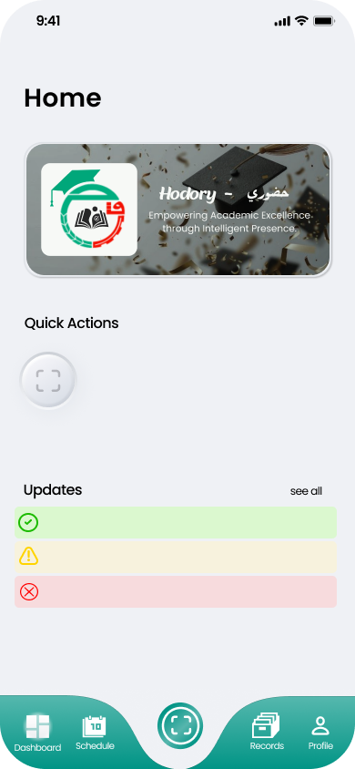
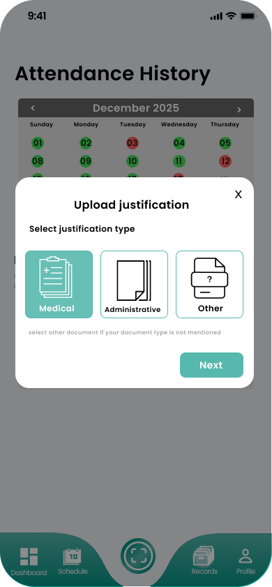
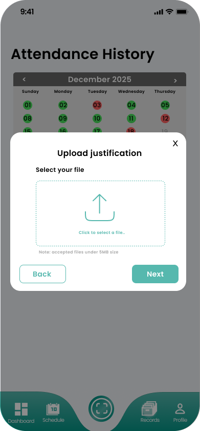

# Hodory Student App (Mobile)

Student mobile app for the Hodory Attendance System, built with Expo + React Native.

<p align="center">
  
  
  
  
  
</p>

## Screenshots

<p align="center">
  
  
  
  
</p>

<p align="center">
  
  
</p>

## Setup

Prerequisites:
- Node.js 18+ (recommended)
- Bun (optional) or npm

Install dependencies:
```bash
cd frontend_mobile_app
bun install
```

Run the app:
```bash
bun start
```

## API Configuration

Set backend base URL with:
- `EXPO_PUBLIC_API_URL` (example: `http://192.168.1.10:8000/api`)

## Links

- Expo Router docs: https://docs.expo.dev/router/introduction/
- Figma design: https://www.figma.com/design/9tbInW4olc881fA9xrHBhL/student-attn?node-id=141-229
- Project documentation: https://sidali-djeghbal.github.io/software-engineering/
